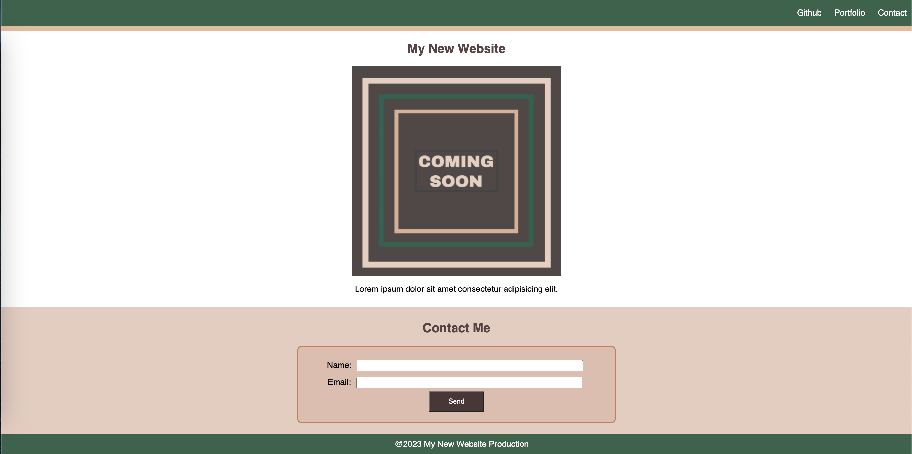

# My New Website

Welcome to "My New Website" – a simple webpage created for beginners to explore HTML and CSS. This project serves as a starting point for those learning web development basics.

# Features

## Navigation Menu:

- Links to GitHub, Portfolio, and Contact.
- Styled with a consistent color scheme.

## Main Content Section:

- Includes a main heading, image, and paragraph.
- Stylishly presented with centered alignment.

## Contact Section:

- Features a contact form with fields for name and email.
- Styled with a background color for emphasis.

## Footer:

- Displays a copyright notice.

## Project Screenshot

